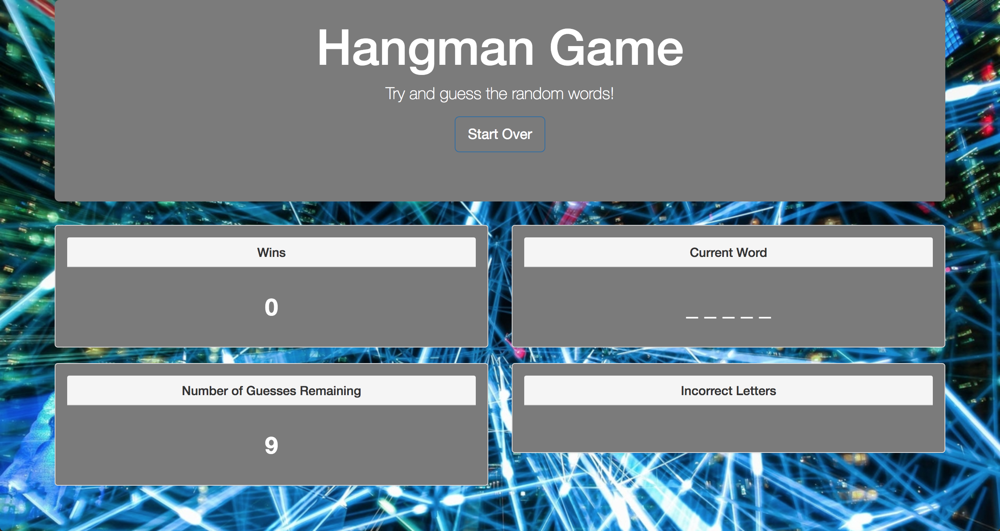

# Hangman-Game

*A simple hangman game built in JavaScript.
*To try it out, open `index.html` in your browser of choice. There are seven words that are randomly chosen upon starting the game.
*You have 9 failed guesses before you lose the game.
*If you'd like add more to these, just add to the `words` variable.

### Thanks and enjoy!

##### Demo: https://hfakhreddine86.github.io/Hangman-Game/

